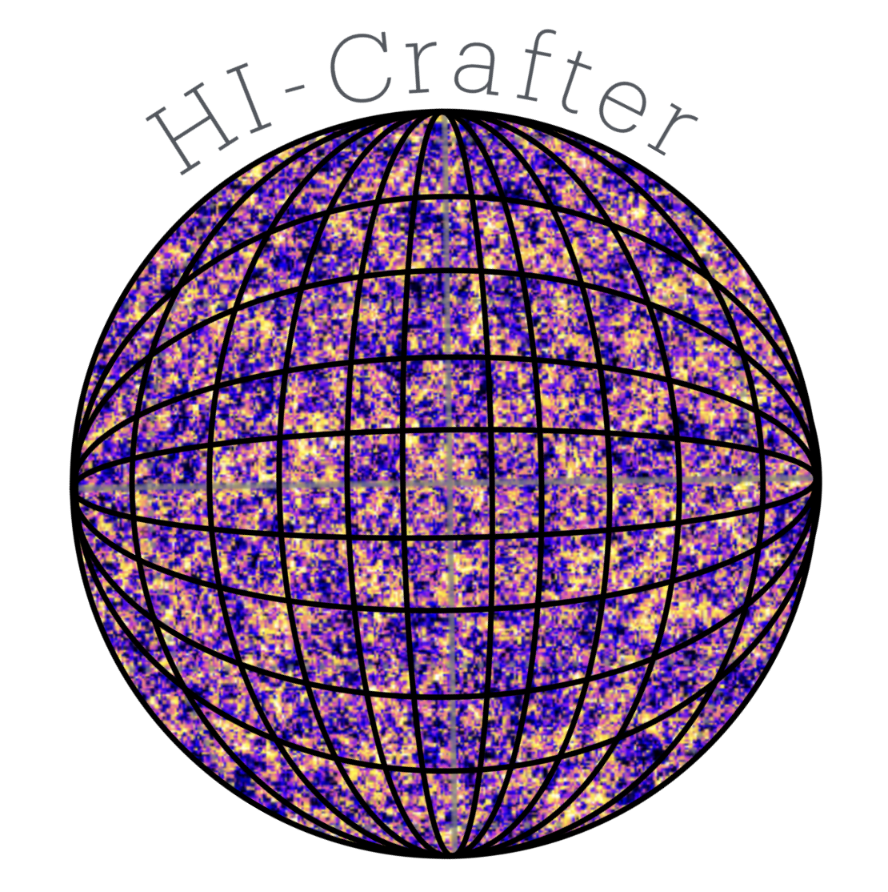

<table>
  <tr>
    <td>
      <h1>HI_FORGE</h1>
      

        HI_FORGE generates realistic HI intensity maps across redshift ranges.
        Features: Gaussian beam/noise/masks/zebras, single maps or Latin Hypercube
        parameter suites for ML/SBI training, multi-bin tomography support.
        Seeds logged 1→N. Perfect for cosmological simulations.
      

    </td>
    <td align="right">
      
    </td>
  </tr>

<tr>
  <td>
    

      HI_FORGE is designed for rapid experimentation and reproducibility,
      enabling large-scale simulation campaigns while preserving precise
      control over astrophysical and instrumental systematics.
    

  </td>
</tr>
</table>

This README explains the package structure, configuration options, and provides guidance for running simulations and using the included tutorials.

<h2>Table of Contents</h2>
<ul>
  <li><a href="#overview">Overview</a></li>
  <li><a href="#features">Features</a></li>
  <li><a href="#installation">Installation</a></li>
  <li><a href="#usage">Usage</a></li>
  <li><a href="#configuration">Configuration</a></li>
  <li><a href="#examples">Examples</a></li>
  <li><a href="#citation">Citation</a></li>
</ul>

<h2 id="overview">Overview</h2>

<strong>HI_FORGE</strong> generates full-sky neutral hydrogen (HI) intensity maps by combining realizations of the
large-scale matter density field with an effective model for the HI brightness temperature, followed by the
application of instrumental and observational effects.

<h2 id="hi-intensity-map-construction">HI intensity map construction</h2>

The HI brightness temperature fluctuation along a direction <code>n̂</code> is modeled as

<pre><code>T_HI(n̂) = ∫_{z_min}^{z_max} T̄_HI(z) · b_HI(z) · δ_m(n̂, z) dz
</code></pre>

where <code>δ_m(n̂, z)</code> is the matter overdensity field, <code>b_HI(z)</code> is the HI bias, and <code>T̄_HI(z)</code> is the mean
HI brightness temperature.

In practice, the redshift integral is discretized into radial shells, yielding

<pre><code>T_HI(n̂) ≈ Σ_i ⟨T̄_HI⟩_i · b_HI(z_i) · δ_i(n̂)
</code></pre>

where <code>δ_i(n̂)</code> are lognormal realizations of the matter field on shell <code>i</code>.

The mean HI brightness temperature is parametrized as

<pre><code>T̄_HI(z) = 189 × 4 × 10^-4 · (1 + z)^2.6 · h / H(z)
</code></pre>

and the HI bias is modeled as

<pre><code>b_HI(z) = 0.6 + 0.3(1 + z)
</code></pre>

<h2 id="beam-smoothing">Beam smoothing</h2>

Finite angular resolution is modeled by convolution with a Gaussian beam. In spherical harmonic space, the observed
coefficients are

<pre><code>a_obs(ℓ, m) = b_ℓ · a(ℓ, m)
</code></pre>

with beam transfer function

<pre><code>b_ℓ = exp[ -½ · ℓ(ℓ + 1) · σ_b^2 ]
σ_b = θ_FWHM / sqrt(8 ln 2)
</code></pre>

<h2 id="thermal-noise">Thermal noise</h2>

Instrumental noise is modeled as additive, uncorrelated Gaussian noise in pixel space,

<pre><code>n(n̂) ~ N(0, σ_n^2)
</code></pre>

such that the noisy map is

<pre><code>T'_HI(n̂) = T_HI(n̂) + n(n̂)
</code></pre>

<h2 id="zebra-striping-systematics">Zebra-striping systematics</h2>

Scan-synchronous striping systematics are modeled as a deterministic modulation added to the map,

<pre><code>S(θ, φ) = A · sin[ (2π / λ) · (sinθ cosφ) ]
</code></pre>

where <code>(θ, φ)</code> are spherical coordinates, <code>λ</code> sets the stripe wavelength, and <code>A</code> is the stripe amplitude.

The final observed map is therefore

<pre><code>T_obs(n̂) = (T_HI * B)(n̂) + n(n̂) + S(n̂)
</code></pre>

with optional masking applied multiplicatively in pixel space.

<h2 id="features">Features</h2>

<ul>
  <li><strong>Lognormal HI intensity maps</strong> — full-sky HI brightness temperature maps generated from lognormal matter-field realizations via <a href="https://glass.readthedocs.io">GLASS</a>.</li>
  <li><strong>Gaussian beam smoothing</strong> — convolve the map with a Gaussian beam of arbitrary FWHM (degrees).</li>
  <li><strong>Thermal noise</strong> — add pixel-level white Gaussian noise with a configurable noise level.</li>
  <li><strong>Zebra-striping systematics</strong> — inject scan-synchronous striping artefacts.</li>
  <li><strong>Sky masking</strong> — apply an external mask (HEALPix FITS or <code>.npy</code> file).</li>
  <li><strong>Latin Hypercube suites</strong> — generate large batches of maps spanning a cosmological parameter space for ML / SBI training.</li>
  <li><strong>Reproducible seeds</strong> — every map is generated from a deterministic seed; seeds are logged 1 → N across a batch.</li>
  <li><strong>Multi-CPU batching</strong> — produce N maps efficiently with <code>generate_batch()</code>.</li>
  <li><strong>Flexible cosmology</strong> — five configurable ΛCDM parameters (h, As, Ωc, Ωb, ns) via <a href="https://camb.info">CAMB</a>.</li>
</ul>

<h2 id="installation">Installation</h2>

We recommend installing HI_FORGE in a new conda environment.

Install HI_FORGE using pip:

<pre><code>pip install hi_forge</code></pre>

To access tutorials and examples, clone the repository:

<pre><code>git clone https://github.com/PaulineGorbatchev/HI_FORGE.git</code></pre>

Dependencies are listed in <code>requirements.txt</code>:

<pre><code>
numpy>=1.21.0
healpy>=1.15.0
camb>=0.5.0
glass>=0.5.0
scipy>=1.8.0
</code></pre>

<h2 id="usage">Usage</h2>

Import <code>HIGenerator</code> from the <code>hi_forge</code> package and call <code>generate_map()</code> to produce a
single HEALPix map, or <code>generate_batch()</code> to produce a numbered set of maps saved to disk.

<pre><code class="language-python">
from hi_forge import HIGenerator

gen = HIGenerator(nside=64, z_min=0.40, z_max=0.45, seed=42)
hi_map = gen.generate_map()   # returns numpy array of shape (hp.nside2npix(nside),)
</code></pre>

To generate a batch of <em>N</em> maps (each with an independent seed offset), use:

<pre><code class="language-python">
maps = gen.generate_batch(n_maps=100, output_dir="output/maps")
</code></pre>

See the <a href="tutorial/tutorial_basic_pipeline.py">basic pipeline tutorial</a> and
<a href="tutorial/Multi_maps_LH.py">Latin Hypercube tutorial</a> for full worked examples.

<h2 id="configuration">Configuration</h2>

All parameters are passed to the <code>HIGenerator</code> constructor.

<table>
  <thead>
    <tr>
      <th>Parameter</th>
      <th>Type</th>
      <th>Default</th>
      <th>Description</th>
    </tr>
  </thead>
  <tbody>
    <tr><td><code>h</code></td><td>float</td><td>0.7</td><td>Dimensionless Hubble constant.</td></tr>
    <tr><td><code>As</code></td><td>float</td><td>2×10−9</td><td>Scalar amplitude of primordial power spectrum.</td></tr>
    <tr><td><code>Oc</code></td><td>float</td><td>0.25</td><td>Cold dark matter density Ωc.</td></tr>
    <tr><td><code>Ob</code></td><td>float</td><td>0.05</td><td>Baryon density Ωb.</td></tr>
    <tr><td><code>ns</code></td><td>float</td><td>0.965</td><td>Scalar spectral index.</td></tr>
    <tr><td><code>nside</code></td><td>int</td><td>32</td><td>HEALPix resolution parameter (capped at 512 for safety). Pixel count = 12 × nside².</td></tr>
    <tr><td><code>z_min</code></td><td>float</td><td>0.4</td><td>Minimum redshift of the survey volume.</td></tr>
    <tr><td><code>z_max</code></td><td>float</td><td>0.45</td><td>Maximum redshift of the survey volume.</td></tr>
    <tr><td><code>nbins</code></td><td>int</td><td>1</td><td>Number of tomographic redshift bins.</td></tr>
    <tr><td><code>sigmaz0</code></td><td>float</td><td>1×10−4</td><td>Photometric redshift uncertainty σz,0.</td></tr>
    <tr><td><code>beam_deg</code></td><td>float or None</td><td>None</td><td>Gaussian beam FWHM in degrees. Set to <code>None</code> to skip smoothing.</td></tr>
    <tr><td><code>noise</code></td><td>bool</td><td>True</td><td>Whether to add thermal noise.</td></tr>
    <tr><td><code>noise_level</code></td><td>float</td><td>1.0</td><td>Standard deviation of the Gaussian noise (same units as THI).</td></tr>
    <tr><td><code>mask_file</code></td><td>str or None</td><td>None</td><td>Path to a sky mask (<code>.npy</code> or HEALPix FITS). Masked pixels are set to zero.</td></tr>
    <tr><td><code>zebras</code></td><td>bool</td><td>False</td><td>Add scan-synchronous zebra-striping systematics.</td></tr>
    <tr><td><code>seed</code></td><td>int</td><td>1</td><td>Base random seed for reproducibility.</td></tr>
  </tbody>
</table>

<h2 id="examples">Examples</h2>

<h3 id="example-map">Baseline HI map</h3>

Generate a baseline HI intensity map without instrumental or observational
effects.

<pre><code class="language-python">
gen = HIGenerator(
    nside=32,
    z_min=0.40,
    z_max=0.45,
    nbins=1,
    sigmaz0=1e-4,
    beam_deg=None,
    noise=False,
    zebras=False,
    seed=1,
)

hi_map = gen.generate_map()
</code></pre>

<h3 id="example-beam">Beam smoothing</h3>

Apply Gaussian beam smoothing to the HI intensity map.

<pre><code class="language-python">
gen_beam = HIGenerator(
    nside=32,
    z_min=0.40,
    z_max=0.45,
    nbins=1,
    sigmaz0=1e-4,
    beam_deg=1.5,
    noise=False,
    zebras=False,
    seed=1,
)

hi_beam = gen_beam.generate_map()
</code></pre>

<h3 id="example-noise">Thermal noise</h3>

Add thermal noise on top of the beam-smoothed HI map.

<pre><code class="language-python">
gen_noise = HIGenerator(
    nside=32,
    z_min=0.40,
    z_max=0.45,
    nbins=1,
    sigmaz0=1e-4,
    beam_deg=1.5,
    noise=True,
    noise_level=1.0,
    zebras=False,
    seed=1,
)

hi_noise = gen_noise.generate_map()
</code></pre>

<h3 id="example-zebras">Zebra-striping systematics</h3>

Add zebra-striping systematics in addition to beam smoothing and noise.

<pre><code class="language-python">
gen_zebra = HIGenerator(
    nside=32,
    z_min=0.40,
    z_max=0.45,
    nbins=1,
    sigmaz0=1e-4,
    beam_deg=1.5,
    noise=True,
    noise_level=1.0,
    zebras=True,
    seed=1,
)

hi_zebra = gen_zebra.generate_map()
</code></pre>

<h2 id="citation">Citation</h2>

If you use HI_FORGE in your research, please cite the repository:

<pre><code>@software{hi_forge,
  author  = {Gorbatchev, Pauline},
  title   = {HI\_FORGE: HI Intensity Map Generator},
  url     = {https://github.com/PaulineGorbatchev/HI_FORGE},
  version = {0.1.0}
}
</code></pre>

